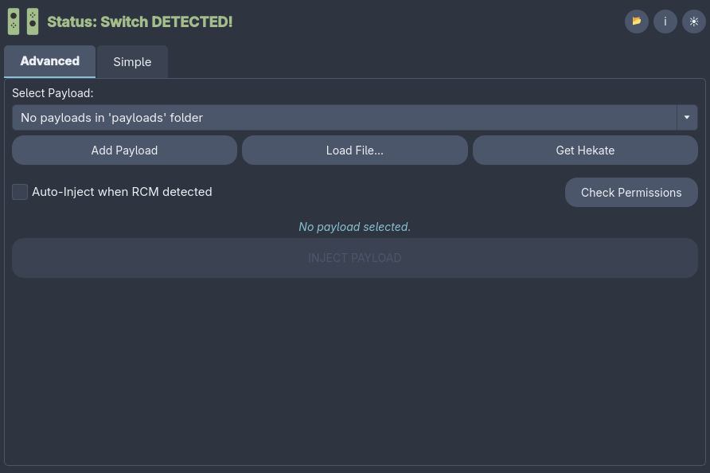

# 

**FuseeFlow** is a modern graphical user interface for injecting payloads into a Nintendo Switch in RCM (Recovery Mode). It provides a streamlined experience for launching payloads like Hekate, Fusee, and others using `fusee-nano` as the backend.



## Features

- 🚀 **One-Click Injection:** fast and reliable payload injection.
- 🎨 **Modern GUI:** Built with PyQt6 for a clean look on Linux.
- 📂 **Payload Management:** Easily load, manage, and favorite your payloads.
- 🐧 **Linux Native:** Runs natively on Linux.
- 🔌 **Automatic Detection:** Identifies when a Switch is connected in RCM mode.

## Prerequisites

- **Nintendo Switch** in RCM mode (using a jig or other method).
- **USB-C cable** to connect the Switch to your PC.
- **Python 3.8+** installed.

---

## 🐧 Linux Installation

### 1. Clone the Repository
Start by cloning the repository and navigating into the directory:
```bash
git clone https://github.com/LouBoi161/FuseeFlow.git
cd FuseeFlow
```

### 2. System Dependencies

You need `libusb` and the `fusee-nano` binary.

**Arch Linux / Manjaro:**
```bash
sudo pacman -S python python-pip libusb
yay -S fusee-nano
```

**Debian / Ubuntu / Mint:**
```bash
sudo apt update
sudo apt install python3 python3-pip libusb-1.0-0-dev
# You will need to download/build fusee-nano manually or place the provided binary in the app folder.
```

**Fedora:**
```bash
sudo dnf install python3 python3-pip libusb1-devel
```

### 3. Python Dependencies
```bash
pip install -r requirements.txt
```

### 4. USB Permissions (Critical)
To access the Switch without root, add a udev rule:

1.  Create `/etc/udev/rules.d/99-switch.rules`:
    ```bash
    sudo nano /etc/udev/rules.d/99-switch.rules
    ```
2.  Paste this line:
    ```
    SUBSYSTEM=="usb", ATTRS{idVendor}=="0955", ATTRS{idProduct}=="7321", MODE="0666"
    ```
3.  Reload rules:
    ```bash
    sudo udevadm control --reload-rules && sudo udevadm trigger
    ```

### 5. Running
```bash
python main.py
```

---


## ⚙️ Configuration

- **Payloads:** Place your `.bin` payloads in the `payloads/` folder to have them auto-detected.
- **fusee-nano:** The app looks for `fusee-nano` in the current folder, `~/bin`, or your system PATH.

## License

MIT License. See [LICENSE](LICENSE) file for details.